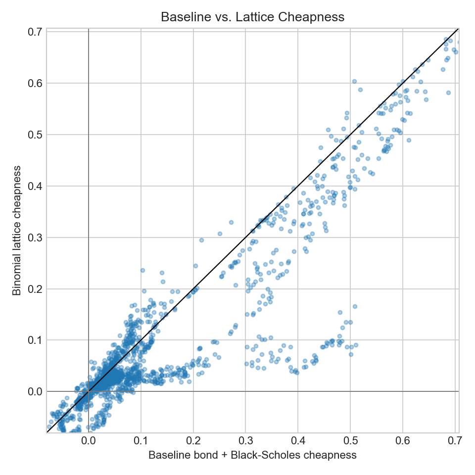
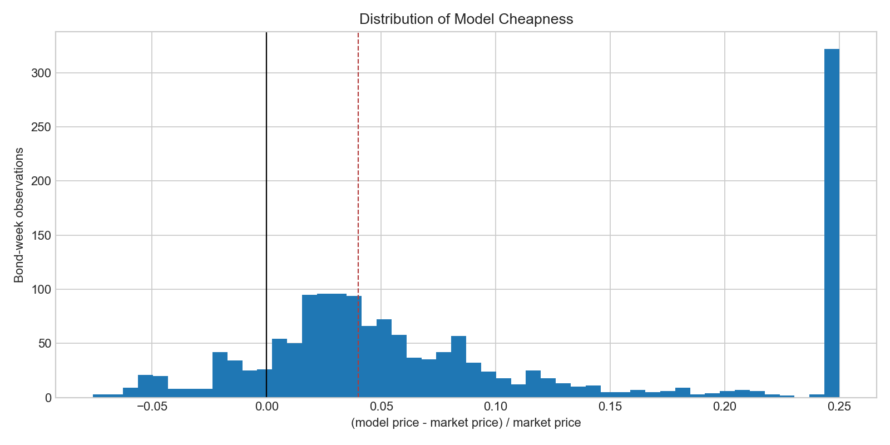
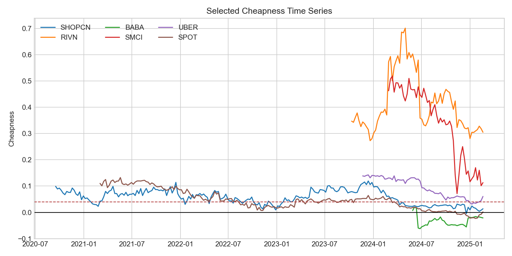
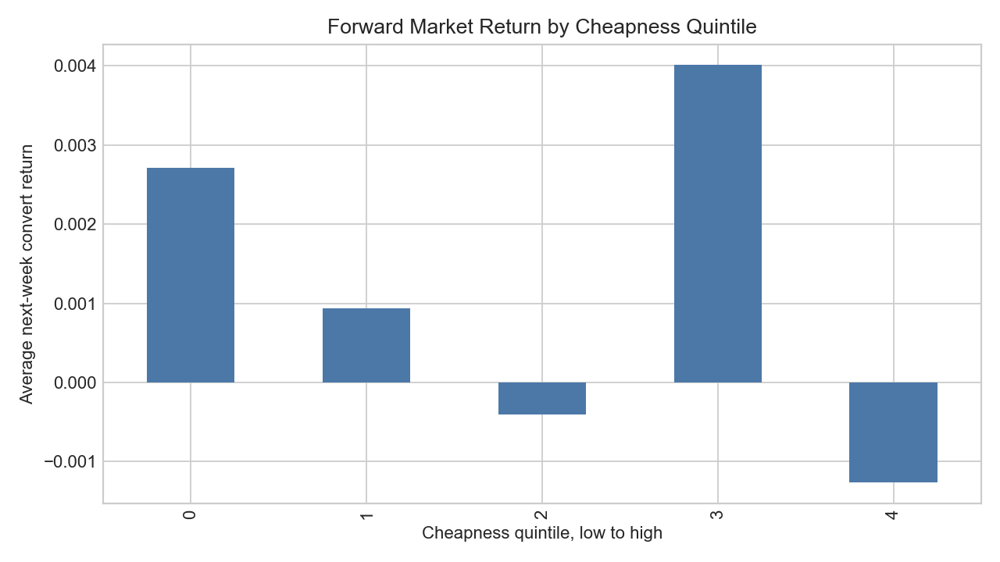
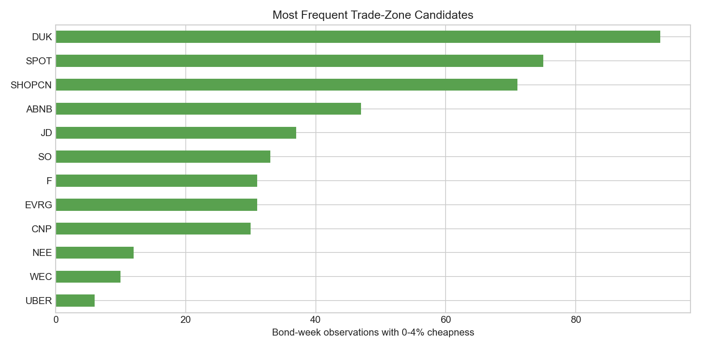
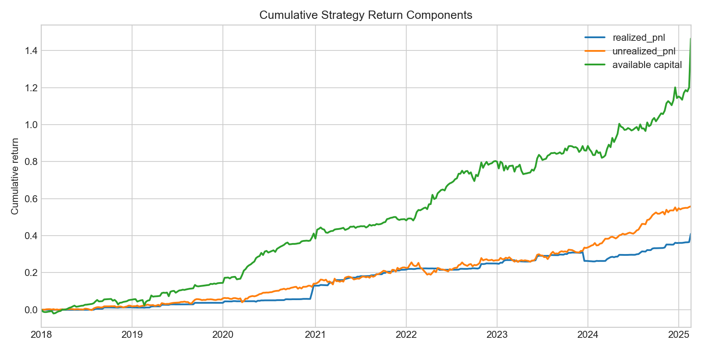
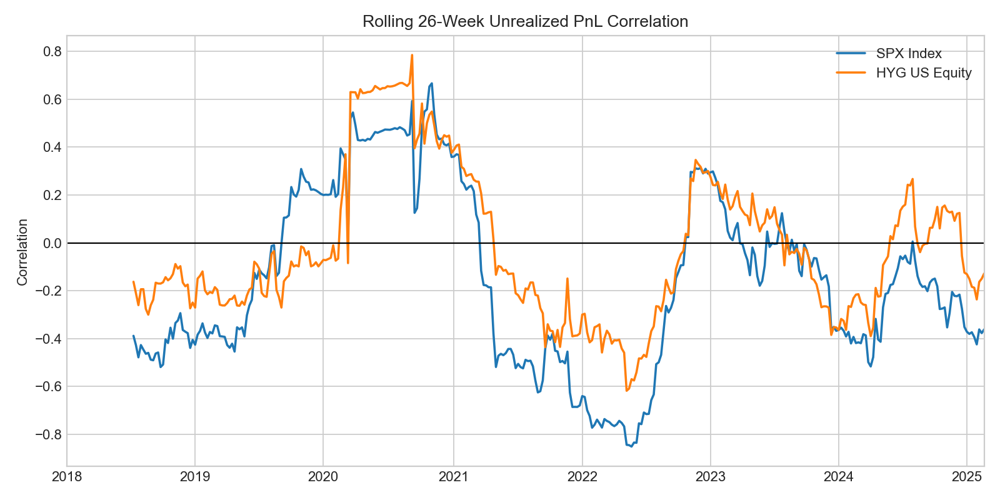

# Comprehensive Convertible Bond Arbitrage Project

## Executive Summary

This refreshed project turns the original convertible bond arbitrage idea into a fuller research note and reproducible analysis. The strategy is to identify convertible bonds that appear cheap relative to a bond-floor-plus-option model, go long selected converts, and hedge the major systematic risks with short underlying equity and Treasury exposure.

The upgraded analysis adds four pieces that were thin in the original draft:

- A data audit of the convertible universe and model/market price coverage.
- A signal study measuring how model cheapness is distributed across bonds and whether cheapness relates to subsequent market-price movement.
- A portfolio diagnostics section covering annualized performance, drawdowns, tail risk, skew/kurtosis, and stress periods.
- A factor-risk section covering correlations and multi-factor beta estimates versus equity, credit, rates-sensitive, regional, and hedge-fund-style benchmarks.

## Data and Universe

The project uses weekly observations from the existing Bloomberg-derived files in `data/`. Market convertible prices are quoted per 100 and are scaled by 10 to compare with the model's $1,000 face-value price convention.

| Item | Value |
|---|---:|
| Convertible tickers in price matrix | 16 |
| Weekly observations in model/market panel | 232 |
| First model/market date | 2020-09-16 |
| Last model/market date | 2025-02-19 |
| Strategy return observations | 372 |

### Coverage and Cheapness by Ticker

| index  | obs      | coverage_pct | avg_cheapness | median_cheapness | pct_model_cheap | pct_trade_zone_0_to_4pct | pct_rich |
| ------ | -------- | ------------ | ------------- | ---------------- | --------------- | ------------------------ | -------- |
| LCID   | 167.0000 | 0.7198       | 0.4808        | 0.4875           | 0.7198          | 0.0000                   | 0.0000   |
| RIVN   | 72.0000  | 0.3103       | 0.4148        | 0.3692           | 0.3103          | 0.0000                   | 0.0000   |
| SMCI   | 52.0000  | 0.2241       | 0.3385        | 0.3680           | 0.2241          | 0.0000                   | 0.0000   |
| ABNB   | 207.0000 | 0.8922       | 0.1926        | 0.1740           | 0.8922          | 0.2026                   | 0.0000   |
| UBER   | 66.0000  | 0.2845       | 0.0942        | 0.0932           | 0.2845          | 0.0259                   | 0.0000   |
| WEC    | 39.0000  | 0.1681       | 0.0661        | 0.0576           | 0.1681          | 0.0431                   | 0.0000   |
| SHOPCN | 232.0000 | 1.0000       | 0.0576        | 0.0581           | 0.9957          | 0.3060                   | 0.0043   |
| SPOT   | 208.0000 | 0.8966       | 0.0476        | 0.0451           | 0.8319          | 0.3233                   | 0.0647   |
| EVRG   | 64.0000  | 0.2759       | 0.0446        | 0.0411           | 0.2759          | 0.1336                   | 0.0000   |
| SO     | 42.0000  | 0.1810       | 0.0332        | 0.0346           | 0.1810          | 0.1422                   | 0.0000   |
| JD     | 40.0000  | 0.1724       | 0.0250        | 0.0276           | 0.1681          | 0.1595                   | 0.0043   |
| CNP    | 30.0000  | 0.1293       | 0.0234        | 0.0225           | 0.1293          | 0.1293                   | 0.0000   |
| DUK    | 99.0000  | 0.4267       | 0.0220        | 0.0226           | 0.4267          | 0.4009                   | 0.0000   |
| F      | 206.0000 | 0.8879       | 0.0157        | -0.0005          | 0.4397          | 0.1336                   | 0.4483   |
| NEE    | 52.0000  | 0.2241       | -0.0070       | -0.0068          | 0.0517          | 0.0517                   | 0.1724   |
| BABA   | 39.0000  | 0.1681       | -0.0330       | -0.0327          | 0.0129          | 0.0129                   | 0.1552   |

## Strategy Methodology

The project keeps the original economic intuition but makes the workflow more explicit:

1. Estimate each convertible's straight-bond value using the Treasury zero curve plus a credit spread proxy.
2. Estimate the embedded conversion option using Black-Scholes with a volatility thesis combining implied and realized volatility.
3. Compute model cheapness as `(model price - market price) / market price`.
4. Enter long convertible positions when cheapness is positive but not extreme, with position size increasing with cheapness.
5. Hedge equity delta through the underlying stock and hedge duration through Treasury exposure.
6. Track realized PnL, unrealized PnL, available capital, market exposures, and stress-period behavior.

## Enhanced Pricing Model: Binomial Convertible Lattice

The project now includes a simplified credit-adjusted binomial lattice model as an enhanced pricing check. The lattice uses the existing data: underlying stock price, conversion ratio, coupon and maturity parsed from each bond description, Treasury curve, CDS spread, dividend yield, and implied volatility.

At each node, the model compares the value of continuing to hold the convertible against immediate conversion value:

`node value = max(discounted expected continuation value + coupon accrual, conversion ratio * stock price)`

This is more appropriate than a pure Black-Scholes embedded-call approximation because it allows conversion decisions before maturity. The implementation still omits issuer call schedules, investor puts, make-whole provisions, and term-sheet-specific conversion restrictions because those fields are not present in the current dataset.

### Baseline vs. Lattice Model Comparison

| ticker | obs      | baseline_avg_cheapness | lattice_avg_cheapness | avg_lattice_minus_baseline_pct_market | baseline_trade_zone_rate | lattice_trade_zone_rate |
| ------ | -------- | ---------------------- | --------------------- | ------------------------------------- | ------------------------ | ----------------------- |
| F      | 206.0000 | 0.0157                 | 0.0274                | 0.0117                                | 0.1336                   | 0.0517                  |
| SMCI   | 52.0000  | 0.3385                 | 0.3458                | 0.0073                                | 0.0000                   | 0.0000                  |
| SPOT   | 208.0000 | 0.0476                 | 0.0436                | -0.0041                               | 0.3233                   | 0.5345                  |
| CNP    | 30.0000  | 0.0234                 | 0.0189                | -0.0045                               | 0.1293                   | 0.1164                  |
| NEE    | 52.0000  | -0.0070                | -0.0116               | -0.0046                               | 0.0517                   | 0.0172                  |
| DUK    | 99.0000  | 0.0220                 | 0.0143                | -0.0077                               | 0.4009                   | 0.4224                  |
| EVRG   | 64.0000  | 0.0446                 | 0.0300                | -0.0147                               | 0.1336                   | 0.2112                  |
| SO     | 42.0000  | 0.0332                 | 0.0183                | -0.0149                               | 0.1422                   | 0.1810                  |
| SHOPCN | 232.0000 | 0.0576                 | 0.0352                | -0.0223                               | 0.3060                   | 0.6595                  |
| WEC    | 39.0000  | 0.0661                 | 0.0335                | -0.0326                               | 0.0431                   | 0.1207                  |
| LCID   | 167.0000 | 0.4808                 | 0.4462                | -0.0347                               | 0.0000                   | 0.0000                  |
| BABA   | 39.0000  | -0.0330                | -0.0742               | -0.0412                               | 0.0129                   | 0.0000                  |
| JD     | 40.0000  | 0.0250                 | -0.0472               | -0.0722                               | 0.1595                   | 0.0043                  |
| UBER   | 66.0000  | 0.0942                 | 0.0148                | -0.0794                               | 0.0259                   | 0.2026                  |
| RIVN   | 72.0000  | 0.4148                 | 0.3057                | -0.1092                               | 0.0000                   | 0.0000                  |
| ABNB   | 207.0000 | 0.1926                 | 0.0470                | -0.1456                               | 0.2026                   | 0.4784                  |

### Baseline vs. Lattice Signal Quality

This table tests whether the valuation signal has a stronger relationship with next-week convertible market returns under the baseline model or the lattice model. The goal is not to prove causality, but to check whether the improved pricing model produces a more useful ranking signal.

| model    | observations | signal_fwd_return_corr | top_minus_bottom_quintile_fwd_return | trade_zone_obs | trade_zone_avg_fwd_return | trade_zone_hit_rate |
| -------- | ------------ | ---------------------- | ------------------------------------ | -------------- | ------------------------- | ------------------- |
| baseline | 1599.0000    | 0.0046                 | -0.0040                              | 471.0000       | 0.0017                    | 0.5520              |
| lattice  | 1599.0000    | 0.0251                 | -0.0025                              | 689.0000       | 0.0015                    | 0.5718              |

### Lattice Sensitivity Analysis

Convertible valuation is especially sensitive to volatility and credit assumptions. This section shocks the lattice fair value to approximate the directional effect of higher/lower volatility and credit spread assumptions on average cheapness and trade-zone frequency.

| scenario              | avg_lattice_cheapness | change_vs_base | trade_zone_rate |
| --------------------- | --------------------- | -------------- | --------------- |
| base lattice          | 0.0921                | 0.0000         | 0.1875          |
| volatility -10%       | 0.0538                | -0.0382        | 0.0638          |
| volatility +10%       | 0.1303                | 0.0382         | 0.0480          |
| credit spread -50 bps | 0.1084                | 0.0164         | 0.1447          |
| credit spread +50 bps | 0.0757                | -0.0164        | 0.1546          |

## Signal Diagnostics

The cheapness distribution is broad, which is exactly where a relative-value process needs discipline. The core strategy restricts entries to a bounded cheapness region so that obvious data problems or distressed names do not dominate sizing.

### Forward Return by Cheapness Quintile

| cheapness_quintile | avg_cheapness | avg_fwd_1w_return | hit_rate | obs      |
| ------------------ | ------------- | ----------------- | -------- | -------- |
| 0                  | -0.0130       | 0.0027            | 0.5687   | 320.0000 |
| 1                  | 0.0274        | 0.0009            | 0.5281   | 320.0000 |
| 2                  | 0.0542        | -0.0004           | 0.5361   | 319.0000 |
| 3                  | 0.1209        | 0.0040            | 0.5437   | 320.0000 |
| 4                  | 0.4629        | -0.0013           | 0.4781   | 320.0000 |

## Implemented Trade-Zone Diagnostics

The project now exports a candidate-level signal ledger to `reports/tables/candidate_signal_ledger.csv`. Each row is one bond-week with market price, model price, cheapness, next-week market return, and flags for whether it falls into the strategy's 0-4% cheapness trade zone.

### Trade-Zone Summary

| ticker | observations | avg_cheapness | trade_zone_obs | trade_zone_rate | avg_fwd_return | trade_zone_avg_fwd_return | trade_zone_share_of_all_candidates |
| ------ | ------------ | ------------- | -------------- | --------------- | -------------- | ------------------------- | ---------------------------------- |
| DUK    | 99.0000      | 0.0220        | 93.0000        | 0.9394          | 0.0002         | 0.0003                    | 0.1942                             |
| SPOT   | 208.0000     | 0.0476        | 75.0000        | 0.3606          | 0.0015         | 0.0025                    | 0.1566                             |
| SHOPCN | 232.0000     | 0.0576        | 71.0000        | 0.3060          | 0.0003         | 0.0012                    | 0.1482                             |
| ABNB   | 207.0000     | 0.1926        | 47.0000        | 0.2271          | -0.0003        | 0.0007                    | 0.0981                             |
| JD     | 40.0000      | 0.0250        | 37.0000        | 0.9250          | 0.0032         | 0.0032                    | 0.0772                             |
| SO     | 42.0000      | 0.0332        | 33.0000        | 0.7857          | 0.0013         | 0.0014                    | 0.0689                             |
| EVRG   | 64.0000      | 0.0446        | 31.0000        | 0.4844          | 0.0020         | 0.0029                    | 0.0647                             |
| F      | 206.0000     | 0.0157        | 31.0000        | 0.1505          | 0.0002         | -0.0033                   | 0.0647                             |
| CNP    | 30.0000      | 0.0234        | 30.0000        | 1.0000          | 0.0019         | 0.0019                    | 0.0626                             |
| NEE    | 52.0000      | -0.0070       | 12.0000        | 0.2308          | 0.0026         | 0.0106                    | 0.0251                             |
| WEC    | 39.0000      | 0.0661        | 10.0000        | 0.2564          | 0.0038         | 0.0015                    | 0.0209                             |
| UBER   | 66.0000      | 0.0942        | 6.0000         | 0.0909          | 0.0040         | 0.0261                    | 0.0125                             |

## Portfolio Performance and Risk

| index             | weeks    | ann_return | ann_vol | sharpe | hit_rate | skew   | excess_kurtosis | var_5   | cvar_5  | max_drawdown | dd_start   | dd_end     |
| ----------------- | -------- | ---------- | ------- | ------ | -------- | ------ | --------------- | ------- | ------- | ------------ | ---------- | ---------- |
| realized_pnl      | 372.0000 | 0.0492     | 0.0303  | 0.7804 | 0.6667   | 2.3283 | 44.9790         | -0.0006 | -0.0033 | -0.0388      | 2023-12-13 | 2024-01-24 |
| unrealized_pnl    | 371.0000 | 0.0642     | 0.0410  | 0.9320 | 0.5849   | 0.4780 | 2.5283          | -0.0077 | -0.0107 | -0.0529      | 2022-01-26 | 2022-04-13 |
| available capital | 372.0000 | 0.1344     | 0.0765  | 1.3620 | 0.7231   | 3.7896 | 40.2302         | -0.0115 | -0.0169 | -0.0393      | 2022-12-28 | 2023-04-19 |

### Worst Weekly Returns

| index | strategy_leg   | date       | return  |
| ----- | -------------- | ---------- | ------- |
| 0     | realized_pnl   | 2023-12-20 | -0.0366 |
| 1     | realized_pnl   | 2022-05-18 | -0.0061 |
| 2     | realized_pnl   | 2023-03-22 | -0.0041 |
| 3     | realized_pnl   | 2020-05-13 | -0.0027 |
| 4     | realized_pnl   | 2024-04-17 | -0.0019 |
| 5     | realized_pnl   | 2024-12-25 | -0.0011 |
| 6     | realized_pnl   | 2023-01-11 | -0.0010 |
| 7     | realized_pnl   | 2019-01-09 | -0.0010 |
| 8     | realized_pnl   | 2020-02-26 | -0.0008 |
| 9     | realized_pnl   | 2024-01-10 | -0.0008 |
| 10    | unrealized_pnl | 2022-03-02 | -0.0198 |
| 11    | unrealized_pnl | 2020-03-18 | -0.0197 |
| 12    | unrealized_pnl | 2024-12-25 | -0.0120 |
| 13    | unrealized_pnl | 2022-02-02 | -0.0120 |
| 14    | unrealized_pnl | 2021-03-31 | -0.0117 |

## Factor Exposures

The portfolio is designed to be less dependent on broad equity direction than an outright long equity portfolio, but it still carries exposure to credit conditions, growth equity regimes, and residual hedging error.

### Correlations

| index             | SPX Index | LQD US Equity | HYG US Equity | WORLD Index | SX5E Index | HSI Index | CCMP Index | GSTHHVIP Index |
| ----------------- | --------- | ------------- | ------------- | ----------- | ---------- | --------- | ---------- | -------------- |
| realized_pnl      | 0.0144    | 0.0122        | 0.0306        | 0.0112      | 0.0216     | 0.0273    | -0.0047    | 0.0036         |
| unrealized_pnl    | -0.1264   | 0.1240        | 0.0597        | -0.0427     | 0.0972     | 0.0403    | -0.1803    | -0.1441        |
| available capital | -0.0109   | -0.0116       | -0.0264       | 0.0077      | 0.0449     | 0.0621    | -0.0092    | -0.0109        |

### Multi-Factor Betas

| strategy_leg      | alpha_weekly | r2     | beta_SPX Index | beta_LQD US Equity | beta_HYG US Equity | beta_WORLD Index | beta_SX5E Index | beta_HSI Index | beta_CCMP Index | beta_GSTHHVIP Index |
| ----------------- | ------------ | ------ | -------------- | ------------------ | ------------------ | ---------------- | --------------- | -------------- | --------------- | ------------------- |
| realized_pnl      | 0.0010       | 0.0082 | 0.0681         | 0.0000             | 0.0269             | -0.0751          | 0.0114          | 0.0116         | -0.0237         | 0.0030              |
| unrealized_pnl    | 0.0016       | 0.1763 | -0.1439        | 0.0322             | 0.0876             | 0.2298           | 0.0280          | -0.0085        | -0.0502         | -0.0744             |
| available capital | 0.0025       | 0.0138 | -0.0458        | -0.0068            | -0.0595            | 0.0111           | 0.0550          | 0.0209         | 0.0435          | -0.0412             |

## Stress Periods

| period                    | start      | end        | realized_total | unrealized_total | available_capital_total | spx_total | hyg_total |
| ------------------------- | ---------- | ---------- | -------------- | ---------------- | ----------------------- | --------- | --------- |
| COVID shock               | 2020-02-19 | 2020-04-08 | -0.0007        | -0.0024          | 0.0473                  | -0.1863   | -0.1254   |
| 2022 rates/credit selloff | 2022-01-05 | 2022-10-12 | 0.0055         | 0.0096           | 0.1610                  | -0.2537   | -0.1779   |
| AI/growth rebound         | 2023-01-04 | 2023-12-27 | 0.0111         | 0.0527           | 0.0310                  | 0.2639    | 0.0731    |
| Late sample               | 2024-01-03 | 2025-03-12 | 0.1161         | 0.1688           | 0.3257                  | 0.2850    | 0.0232    |

## Improvements Over the Original Draft

- The data section explicitly documents conventions, sample period, coverage, and the $100 versus $1,000 price-scaling issue.
- Cheapness is analyzed as a signal, not merely used as a trading rule.
- The pricing section now includes a simplified credit-adjusted binomial convertible lattice and compares it with the baseline bond-plus-Black-Scholes model.
- Baseline-vs-lattice signal quality and lattice sensitivity analysis are now exported as reusable research tables.
- Performance is evaluated with drawdown, VaR/CVaR, skew, kurtosis, and hit rate.
- Factor risk is measured with both correlations and multi-factor betas.
- Stress periods connect the strategy to real market regimes, including COVID, the 2022 rates/credit selloff, and the later growth-equity rebound.
- The analysis now writes reusable CSV outputs for the signal ledger, trade-zone summary, performance metrics, factor regressions, stress periods, and worst weeks.

## Limitations and Next Enhancements

- The model uses a simplified bond-plus-option framework and does not fully model issuer calls, puts, make-whole provisions, soft-call triggers, borrow constraints, or stochastic credit-equity correlation.
- The new lattice improves early-conversion treatment, but remains simplified because call schedules, put schedules, make-whole tables, recovery assumptions, and conversion restriction windows are not available in the dataset.
- CDS spreads are used as a market credit proxy, so much of the model's active view comes from volatility rather than independent credit underwriting.
- Convertible bond prices are OTC and may be stale; a production system would need bid/ask quotes, TRACE-style liquidity indicators where available, and execution slippage models.
- The current saved data supports a candidate-level signal ledger. Full executed-position cash-flow attribution would require the original simulator to return every entry, rehedge, coupon, dividend, borrow-cost, transaction-cost, and exit event.
